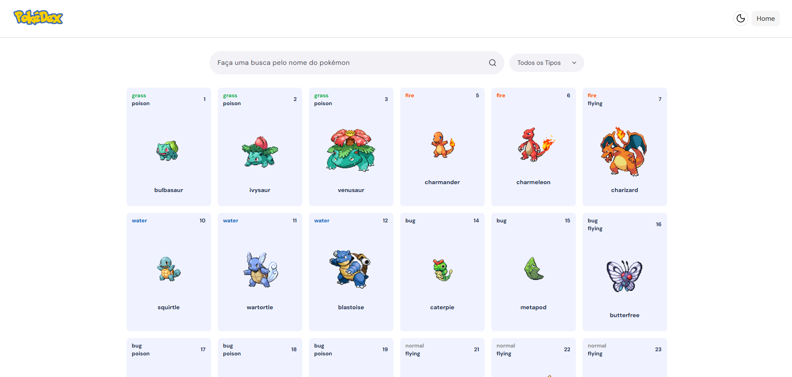
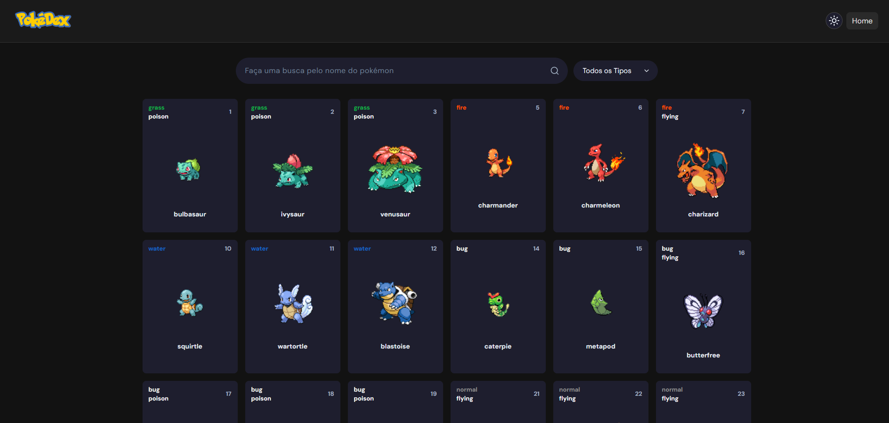

# ⚡ PokéDex - Single Page Application (SPA)

Uma aplicação interativa e responsiva para exploração de Pokémon, desenvolvida inteiramente com **JavaScript Vanilla**. O projeto foca no consumo técnico e eficiente da [PokéAPI](https://pokeapi.co/), aplicando conceitos avançados de manipulação de DOM e gerenciamento de estado no lado do cliente.

---

## 📝 Resumo do Projeto
Este projeto vai além de um simples consumo de API. O objetivo foi construir uma arquitetura robusta de front-end sem o uso de frameworks (como React ou Vue), demonstrando domínio em programação assíncrona, tratamento de erros e experiência do usuário (UX). A aplicação gerencia um grande volume de dados na memória, otimizando a renderização através de paginação matemática e filtros cruzados.

## ✨ Funcionalidades em Destaque

* **🔍 Filtros Combinados:** Busca por nome e tipo simultaneamente utilizando métodos de array de alta performance (`.filter` e `.some`).
* **📄 Paginação Dinâmica:** Renderização otimizada fatiando os dados em tempo real para poupar processamento.
* **🔗 State na URL (History API):** Sincronização silenciosa da página na URL (`?pagina=X`), permitindo atualizar a aba ou compartilhar o link sem perder o progresso.
* **⏳ Skeleton Loading:** Feedback visual moderno durante o carregamento da API para aprimorar a UX.
* **🛡️ Tratamento de Erros:** Prevenção de quebras de tela com `Early Return` e validação de buscas vazias.
* **🌙 Dark Mode:** Alternância nativa entre temas claro e escuro usando manipulação de classes e CSS.

## 🛠️ Tecnologias & Conceitos Aplicados

* **JavaScript Vanilla (ES6+):** `async/await`, `Fetch API`, manipulação de Objetos e Arrays, Event Listeners.
* **Engenharia de Front-End:** Componentização visual via Template Literals e separação de responsabilidades (DRY - *Don't Repeat Yourself*).
* **CSS3 Moderno:** Grid Layout, Flexbox, Media Queries para responsividade total (Mobile First) e animações `@keyframes`.
* **HTML5:** Semântica estrutural e acessibilidade.

## 📸 Preview do Projeto

<table>
  <tr>
    <td align="center"><strong>Modo Claro</strong></td>
    <td align="center"><strong>Modo Escuro</strong></td>
  </tr>
  <tr>
    <td></td>
    <td></td>
  </tr>
</table>

## 🚀 Como Executar Localmente

Não há necessidade de Node.js ou gerenciadores de pacotes. O projeto roda nativamente no navegador.

1. Clone este repositório:
   ```bash
   git clone [https://github.com/SEU_USUARIO/pokedex-js.git](https://github.com/SEU_USUARIO/pokedex-js.git)
